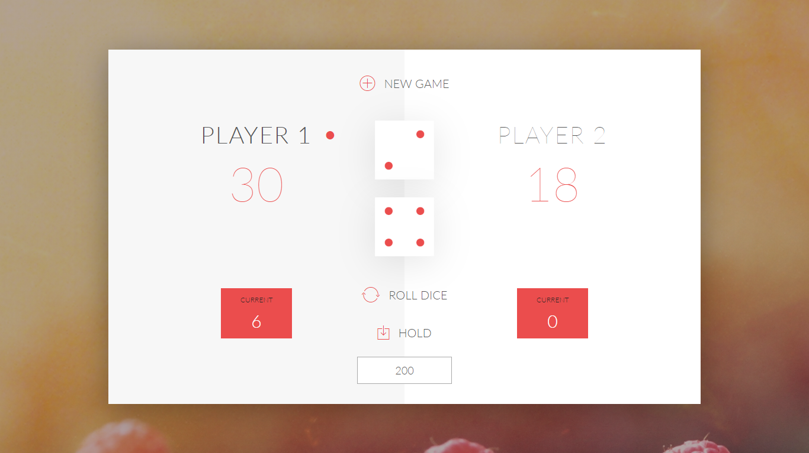

# Pig Game JS

> A classic dice roll game written in Vanilla JS based on DOM manipulation.




 &nbsp; &nbsp;  &nbsp; &nbsp;

## Table of contents

- [Pig Game JS](#pig-game-js)
  - [Table of contents](#table-of-contents)
  - [General info](#general-info)
    - [Game Rules](#game-rules)
  - [Technologies](#technologies)
  - [Installation and Usage](#installation-and-usage)
    - [Dev Mode](#dev-mode)
    - [Prod Mode](#prod-mode)
    - [Live Demo](#live-demo)
  - [Status](#status)
  - [Contact](#contact)

## General info

This is a simple dice game where two players have to roll the dices until they achieve a score of 100. You can also have the chance to set up a provided score. Each player then repeatedly rolls the dices until either of them rolls 1 or the player decides to "hold".

### Game Rules

- The game has 2 players, playing in rounds
- In each turn, a player rolls the dices as many times as he whishes. Each result gets added to their ROUND score
- BUT, if the player rolls a 1 in one of the dices, all his ROUND score gets lost. After that, next player's turn will occur automatically.
- The player can choose to 'Hold', which means that his ROUND score gets added to his GLOBAL score. After that, it's the next player's turn.
- The first player to reach the provided points on GLOBAL score wins the game. By default the score is set to 100.

## Technologies

- JavaScript
- HTML 5
- CSS 3

## Installation and Usage

Prerequisites: [Node.js](https://nodejs.org/download/release/v13.14.0/) (13.14.0). As of latest version 14.3.0 some dependencies break at install.

To run this project:

- Clone this repo to your local machine using

```shell
$ git clone https://github.com/francislagares/pig-game-js
```

- Switch into directory

```shell
$ cd pig-game-js
```

- Install dependencies

```shell
$ yarn install
```

### Dev Mode

- Run server

```shell
$ yarn start
```

- Browser will open automatically at http://localhost:3000

### Prod Mode

- Make a build

```shell
$ yarn build
```

- Run Express Server

```shell
$ yarn serve
```

- Open http://localhost:3000 in your browser.

### Live Demo

You can see the application running
[here.](https://francislagares.github.io/pig-game-js/)


## Status

Currently: _finished_.

## Contact

Created by [@francislagares](https://www.linkedin.com/in/francislagares/) - feel free to contact me!
